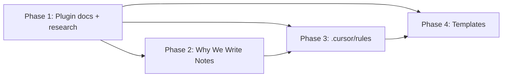

# Vault OS Upgrade — Execution Plan

Four phases, in brief-priority order. Each phase ends by running its quality gate and appending one entry to [`60_Claude/07_AI_Information/Session Logs/log.md`](60_Claude/07_AI_Information/Session Logs/log.md). No vault-root files. No edits to `.obsidian/`, `05_Clippings/`, `50_Archive/`. Secrets in plugin `data.json` get documented as "exists", never copied.

## Locked decisions (from your answers + file findings)
- **Tooling:** `WebFetch`/`WebSearch` on each plugin's official docs, `cursor-ide-browser` MCP for JS-heavy/GitHub pages, and direct filesystem `Read` of each `data.json`. Vault writes use `Write`/`StrReplace` (local filesystem is more reliable than the Obsidian MCP here).
- **Plugin doc shape (hybrid):** deepen the 9 thematic docs in `40_Resources/Obsidian/Plugins/`; split the 5 high-impact plugins into dedicated files.
- **Ground truth:** [`Week - 9.md`](10_Areas/UMN/Previous Classes/Minor/MGMT 3001/Week - 9.md) and [`Week - 4.md`](10_Areas/UMN/Previous Classes/Minor/MGMT 3001/Week - 4.md) are the gold-standard pattern (==anchor==, `*Mechanism:*`, callouts, `## Flashcards #cards/[track]`).

## Dependency flow

Phase 1 produces the plugin-integration facts that Phases 3 and 4 cite; Phase 2 produces the "use-case test" language that Phase 3's rules reference.

---

## Phase 1 — Deep Plugin Reference Notes (Priority 1)

**Plugin → file map (15 plugins, hybrid):**
- New dedicated files: [`QuickAdd Capture Menu.md`](40_Resources/Obsidian/Plugins/QuickAdd Capture Menu.md), [`Excalidraw Diagrams and Annotation.md`](40_Resources/Obsidian/Plugins/Excalidraw Diagrams and Annotation.md), [`Canvas Spatial Maps.md`](40_Resources/Obsidian/Plugins/Canvas Spatial Maps.md), [`Omnisearch and Retrieval.md`](40_Resources/Obsidian/Plugins/Omnisearch and Retrieval.md)
- Deepen in place (already dedicated): [`Spaced Repetition and Learning Loops.md`](40_Resources/Obsidian/Plugins/Spaced Repetition and Learning Loops.md)
- Deepen thematic docs: [`Dataview and Dashboards.md`](40_Resources/Obsidian/Plugins/Dataview and Dashboards.md) (Dataview), [`Tasks Kanban and Project Tracking.md`](40_Resources/Obsidian/Plugins/Tasks Kanban and Project Tracking.md) (Tasks + Kanban), [`Templates Capture and Periodic Notes.md`](40_Resources/Obsidian/Plugins/Templates Capture and Periodic Notes.md) (Templater + Periodic Notes), [`Appearance Code Math and Reading Experience.md`](40_Resources/Obsidian/Plugins/Appearance Code Math and Reading Experience.md) (Latex Suite + Code Styler), [`Search Linking and Navigation.md`](40_Resources/Obsidian/Plugins/Search Linking and Navigation.md) (Hover Editor), [`AI Automation and Local Interfaces.md`](40_Resources/Obsidian/Plugins/AI Automation and Local Interfaces.md) (Copilot + Local REST API), [`Git Recovery and Vault Safety.md`](40_Resources/Obsidian/Plugins/Git Recovery and Vault Safety.md) (Git)
- Convert to short hubs that point to the split-out files: [`Visual Thinking with Canvas and Excalidraw.md`](40_Resources/Obsidian/Plugins/Visual Thinking with Canvas and Excalidraw.md); add pointers from `Templates Capture...` (→ QuickAdd) and `Search Linking...` (→ Omnisearch)
- Update the index + inventory cross-links: [`00 Plugin Reference Index.md`](40_Resources/Obsidian/Plugins/00 Plugin Reference Index.md), [`Plugin Inventory and Configuration Map.md`](40_Resources/Obsidian/Plugins/Plugin Inventory and Configuration Map.md)

**Tools:** `Read` (`.obsidian/plugins/[id]/data.json` + 2-3 real vault notes per plugin) → `WebFetch`/`WebSearch` on the official doc (e.g. quickadd.obsidian.guide, blacksmithgu.github.io/obsidian-dataview, publish.obsidian.md/tasks, silentvoid13.github.io/Templater, help.obsidian.md/canvas, github READMEs for Excalidraw/SR/Kanban/Periodic Notes/Latex Suite/Hover Editor/Local REST API, obsidiancopilot.com/docs) → `cursor-ide-browser` only if a page needs JS rendering → `Write`/`StrReplace`.

**Research steps per plugin (brief's 5-step method):** read `data.json` (note config + redact secrets) → fetch official docs → read 2-3 real vault notes that use it (MGMT 3001 for SR/formatting/Templater; `60_Claude/10_Source_Summaries/` and dashboards for Dataview/Tasks) → write the 7 sections (mechanism / exact settings / integration map / agent rules / failure modes / gold-standard example link / verified open state).

**Per-plugin done condition:** an agent reading only that doc could use the plugin correctly; settings match current `data.json`; example links a real vault note; every "open" item is a specific answerable question, not a vague flag.

**Phase done condition:** all 15 plugins covered across the file map; the 5 split files exist; thematic hubs/pointers updated; index + inventory link the new files; quality gate from brief's "For Plugin Docs" passes; session-log entry appended.

## Phase 2 — Note Philosophy: Why We Write Notes (Priority 2)

**File:** new [`Why We Write Notes.md`](60_Claude/07_AI_Information/Why We Write Notes.md) (confirmed absent).

**Tools:** `Read` (re-skim the audit's failure modes + the two MGMT notes for real examples), then `Write`.

**Research steps:** pull the five use-case tests, the reader model, the note-type table, the compression hierarchy, and the failure modes from the brief's Priority 2 spec; anchor each failure mode to a real audit mistake (duplicate YAML, broken wikilinks, thin content) rather than invented examples.

**Done condition:** all five sections present; note-types table complete; failure modes name what a failed note looks like per test; real vault examples linked; passes brief's "For the Why Document" gate; session-log entry appended.

## Phase 3 — .cursor/rules Enrichment (Priority 3)

**Files (filesystem, `.cursor/rules/`):** expand [`workspace-context.mdc`](.cursor/rules/workspace-context.mdc) and [`human-writing.mdc`](.cursor/rules/human-writing.mdc); create `vault-behavior.mdc`, `note-creation.mdc` (glob `**/*.md`), `plugin-rules.mdc`. Fix the wrong session-log path in `workspace-context.mdc` (`10_Session_Logs` → `07_AI_Information/Session Logs`).

**Tools:** `Read` (Vault Rules 16-point gate, AGENTS routing table, Phase 1 plugin facts, Phase 2 use-case test), then `Write`/`StrReplace`. No external research.

**Research steps:** compress the routing table, frontmatter schema, blank-line rule, 16-point gate, safety constraints, and the plugin decision table into MDC form; `alwaysApply: true` for behavior/writing/plugin rules, glob for `note-creation.mdc`.

**Done condition:** a cold-start Cursor agent could follow each file without opening other docs; routing table + frontmatter schema + compact quality gate + security constraints present; session-log path corrected; passes brief's ".cursor/rules" gate; session-log entry appended.

## Phase 4 — Template Enrichment (Priority 4)

**Files (update existing only, no new template names):** [`Clipping Distill Template.md`](30_Order/Templates/Capability/Clipping Distill Template.md), [`Week Template.md`](30_Order/Templates/Classes/Week Template.md), [`Concept Template.md`](30_Order/Templates/Classes/Concept Template.md), [`For Evergreen.md`](30_Order/Templates/Metadata/For Evergreen.md), [`For Progress.md`](30_Order/Templates/Metadata/For Progress.md), [`Textbook Template.md`](30_Order/Templates/Classes/Textbook Template.md).

**Key fixes:** Clipping Distill gets `## Full Content` (### from source titles), `## Open Questions` as `- [ ]` Tasks, `## Flashcards #cards/[track]`, correct ingestion frontmatter. Week Template gets the `## Lecture-to-textbook synthesis` section taught via the MGMT 3001 pattern. Concept Template: remove invalid `mastery (1/10): 0`, add `track:`/`prerequisites:`/`used_in:`/`evidence:`. For Evergreen/For Progress/Textbook get full body structures per the brief.

**Tools:** `Read` (re-open the two MGMT notes + Phase 1 SR/Tasks/Templater docs for exact syntax), then `StrReplace`/`Write`. No external research.

**Research steps:** match each template to Vault Rules Part 9 (source notes) or the relevant note-type structure; preserve valid Templater syntax (`<% tp.file.title %>`); add a description line under every heading + example content for the most important sections + inline plugin syntax (flashcards, Tasks, LaTeX).

**Done condition:** a note built from each template would pass the 16-point gate on first attempt; no invalid YAML; flashcard sections present where required; each links its gold-standard example; passes brief's "For Templates" gate; session-log entry appended.

## Open questions to resolve during execution (not blocking)
- `data.json` for QuickAdd / Copilot / Local REST API did not appear in the plugins glob. I'll read them if present (redacting secrets); if absent, document from official docs + the existing inventory and flag the gap explicitly.
- QuickAdd capture menu, Omnisearch PDF indexing, and Excalidraw templates are documented as **recommendations/proposals** (not applied) since they require settings changes — consistent with the brief and the "pause before modifying plugin settings" rule.