# Design Document: Claude Code Operations Layer

## Overview

Jarvis has infrastructure but no operator. There are 11 skills, 4 agents, an Obsidian MCP server, a Capability Engine with 5 tracks and 25+ enriched notes, a local CLI that can scan 628 files in seconds, and operating contracts in `CLAUDE.md`, `AGENTS.md`, and `AI_CONTEXT.md`. What's missing is the thing that ties them together into a daily rhythm — the layer that says "run the health check, surface the top 3 problems, route them to the right skill, and log what happened."

The operations layer is a single Claude Code skill (`/ops`) that acts as a dispatcher. It doesn't duplicate existing skills — it orchestrates them. It reads vault state through two channels: the jarvis-cli for cheap deterministic scans (broken links, future dates, metadata gaps) and Obsidian MCP search for semantic queries (capability audit, content analysis). It produces structured reports, maintains a triage queue, and connects morning planning to evening review through the Capability Engine.

The design must work within Claude Code's real extensibility surface: `.claude/skills/`, `.claude/agents/`, `.claude/.mcp.json`, and `CLAUDE.md`. The user runs Claude Code through OpenRouter's free tier, so every operation must be conscious of context budget — batch reads, prefer search over file-by-file scanning, keep reports short and actionable.

## Architecture

```mermaid
graph TD
    subgraph "Entry Point"
        OPS["/ops dispatcher<br>.claude/skills/ops.md"]
    end

    subgraph "Scan Layer"
        CLI["jarvis-cli<br>jarvis.ps1 health/context/links/dates/encoding"]
        MCP["Obsidian MCP<br>search, read_note, list_notes"]
    end

    subgraph "Existing Skills"
        TODAY["/today"]
        CONTEXT["/context"]
        CLOSEDAY["/closeday"]
        LINT["/lint-claude-layer"]
        INGEST["/ingest-clipping"]
        CONNECT["/connect-notes"]
        DISTILL["/distill-note"]
        WEEKLY["/weekly-review"]
    end

    subgraph "Outputs"
        REPORT["Ops Report<br>60_Claude/50_Reviews/"]
        BRIEF["Morning Briefing<br>60_Claude/50_Reviews/"]
        TRIAGE["Triage Queue<br>embedded in report"]
        LOG["Session Log<br>60_Claude/10_Session_Logs/log.md"]
    end

    subgraph "Vault State"
        CE["Capability Engine<br>tracks, drills, outputs"]
        INBOX["Inbox + Clippings<br>backlog counts"]
        PROJ["Projects<br>20_Progress/"]
        DASH["Dashboards<br>60_Claude/60_Indexes/"]
    end

    OPS -->|"morning-start"| CONTEXT
    OPS -->|"morning-start"| TODAY
    OPS -->|"morning-start"| CLI
    OPS -->|"evening-close"| CLOSEDAY
    OPS -->|"health-check"| CLI
    OPS -->|"health-check"| MCP
    OPS -->|"capability-audit"| MCP
    OPS -->|"triage"| CONNECT
    OPS -->|"triage"| INGEST
    OPS -->|"triage"| LINT
    OPS -->|"ingest-batch"| INGEST

    CLI -->|"deterministic counts"| REPORT
    MCP -->|"semantic queries"| REPORT
    OPS --> BRIEF
    OPS --> TRIAGE
    OPS --> LOG

    CE --> MCP
    INBOX --> CLI
    PROJ --> CLI
    DASH --> MCP
```



### Why two scan channels

The jarvis-cli (`jarvis.ps1`) is a Python script that reads every `.md` file, parses frontmatter with regex, and produces counts: broken links, future dates, metadata gaps, duplicate filenames, encoding damage. It runs in seconds, costs zero tokens, and its output is deterministic. The CLI already covers the expensive baseline scan that would otherwise require hundreds of MCP `read_note` calls.

Obsidian MCP is needed for things the CLI can't do: searching note content by keyword, reading specific notes for semantic analysis, checking Capability Engine state (which requires interpreting `track`, `mastery_level`, `next_drill` fields in context), and writing reports back to the vault.

The dispatcher calls CLI first for baseline numbers, then uses MCP selectively for the semantic layer on top.

### Why a single skill, not a new agent

Agents in Claude Code (`.claude/agents/`) are invoked as subagents — they run in a separate context and can't easily chain with the user's current conversation. Skills (`.claude/skills/`) run inline, can reference other skills by name, and maintain conversational context. The `/ops` dispatcher needs to chain `/context` → `/today` → health-check → triage in a single session, so it must be a skill.

The vault-curator agent remains the deep-maintenance counterpart — it handles weekly/monthly structural work that benefits from a fresh context window.

## Components and Interfaces

### Component 1: Ops Dispatcher Skill (`.claude/skills/ops.md`)

The central entry point. Presents a menu, routes to sub-operations, handles errors, logs everything.

**Interface:**
- Input: User invokes `/ops` with optional subcommand (`morning-start`, `health-check`, `triage`, `ingest-batch`, `capability-audit`, `evening-close`, `full-cycle`)
- Output: Structured report or briefing note, session log entry
- Dependencies: All existing skills (by reference, not duplication), jarvis-cli, Obsidian MCP

**Operation modes with cost profiles:**

| Mode | Cost | What it does |
|------|------|-------------|
| `morning-start` | Standard | `/context` + `/today` + health-check + top triage + top drills |
| `health-check` | Lightweight | CLI baseline + MCP spot-checks → Ops Report |
| `capability-audit` | Lightweight | MCP search for track/drill/evidence fields → capability section |
| `triage` | Standard | Present queue, route fixes to existing skills |
| `ingest-batch` | Heavyweight | List clippings, user selects, sequential `/ingest-clipping` |
| `evening-close` | Standard | `/closeday` + capability audit summary + session log |
| `full-cycle` | Heavyweight | morning-start + evening-close bookends |

**Error handling:** If any sub-skill fails, log the error to session log, skip that step, continue. If CLI is unavailable, fall back to MCP-based scanning with a logged warning.

**Safe mutation policy:**
- `scan` and `suggest` modes are read-only
- `fix` mode requires explicit user approval
- Never modify `60_Claude/05_Clippings/`, `50_Archive/`, `.obsidian/`, or MCP config files
- Batch fixes touching >5 notes require a plan before execution
- Notes with `status: tree` get proposed changes shown before applying

### Component 2: Health Check Engine

Runs the six-dimension vault scan. Combines CLI deterministic output with MCP semantic checks.

**Scan dimensions:**

| Dimension | Primary source | Fallback |
|-----------|---------------|----------|
| Frontmatter completeness | CLI `health` (metadata gaps count) | MCP search for notes missing `type`/`status`/`created` |
| Link integrity | CLI `links` (broken + ambiguous counts) | MCP search for `[[` patterns |
| Inbox/clippings backlog | CLI `health` or MCP `list_notes` on `00_Inbox/` and `60_Claude/05_Clippings/` | Direct folder listing |
| Project staleness | CLI `projects` (missing `next`, stale dates) | MCP search in `20_Progress/` |
| Capability Engine gaps | MCP search for `track` field, check `next_drill` dates | Read Capability Dashboard |
| Date consistency | CLI `dates` (future-dated fields) | MCP frontmatter reads |
| Encoding integrity | CLI `encoding` (mojibake hits) | Skipped if CLI unavailable |

**Output:** Structured findings object passed to the report generator.

### Component 3: Capability Audit

Queries the Capability Engine state through MCP.

**Checks:**
1. Total tracked concepts (notes with non-empty `track` field)
2. Mastery distribution (count by `mastery_level`)
3. Overdue drills (notes where `next_drill` < today, sorted by days overdue)
4. Evidence gaps (notes with `track` but empty `evidence`)
5. Stalled outputs (`type: output` with `status: seed` older than 14 days)
6. Underseeded question banks (tracks with <3 open questions)

**Efficiency:** Uses MCP `global_search` with targeted queries rather than reading every note. Example queries:
- Search for `track:` to find all tracked notes
- Search for `next_drill:` to find drill-scheduled notes
- Search for `type: output` to find output notes
- Search in `60_Claude/60_Indexes/Field OS/` for question bank state

### Component 4: Triage Queue Generator

Converts health check and capability audit findings into a prioritized action list.

**Priority levels:**

| Priority | Criteria | Examples |
|----------|----------|---------|
| Critical | Broken required fields, encoding in active contracts | Missing `type` on dashboard note, mojibake in `CLAUDE.md` |
| High | Stale projects, overdue drills, broken links in active notes | Project with no `next` for 30+ days, drill 14+ days overdue |
| Medium | Inbox backlog, unprocessed clippings, weak links | >10 inbox items, >10 unprocessed clippings |
| Low | Orphan notes, archive encoding, cosmetic issues | Orphan in `50_Archive/`, duplicate filename in course notes |

**Routing rules:**
- Broken links → suggest `/connect-notes`
- Unprocessed clippings → suggest `/ingest-clipping` or `/ops ingest-batch`
- Claude layer issues → suggest `/lint-claude-layer`
- Stale projects → suggest manual review with project path
- Overdue drills → suggest drill session with note links
- Encoding damage → suggest targeted cleanup (with user approval)

**Carry-forward:** Each triage item gets a stable identifier: `{category}:{relative_path}:{issue_type}`. Items appearing in 3+ consecutive reports get priority bumped by one level unless explicitly deferred.

### Component 5: Report Generator

Produces the Ops Report, Morning Briefing, and Evening Close notes.

**Ops Report structure** (`60_Claude/50_Reviews/Ops Health - YYYY-MM-DD.md`):

```yaml
---
type: review
status: complete
created: YYYY-MM-DD
tags:
  - review
  - ops-health
notes:
  - "[[60_Claude/50_Reviews/Ops Reports/latest CLI report]]"
---
```

Sections: Summary Table → Frontmatter Drift → Link Health → Date Consistency → Inbox/Clippings Backlog → Project Health → Capability Engine Health → Encoding Integrity → Triage Queue → Comparison (if prior report exists) → Resolved Since Last Report

**Status emojis:** ✅ healthy (0 issues), ⚠️ warning (1-5), ❌ critical (6+ or broken required fields)

**Cross-linking:** Every Ops Report links to the most recent CLI-generated report under `60_Claude/50_Reviews/Ops Reports/` when one exists.

**Morning Briefing** (`60_Claude/50_Reviews/Morning Briefing - YYYY-MM-DD.md`):
- Today's plan (from `/today`)
- Vault health summary (condensed from health-check)
- Top 3 triage items
- Top 3 overdue drills
- Link to previous day's closeday note

**Evening Close:** Appended as a section to the day's Closeday note rather than a separate file. Includes capability audit summary, triage items completed vs remaining, one-line health delta from morning.

### Component 6: Session Log Integration

Every operation appends to `60_Claude/10_Session_Logs/log.md` using the existing convention:

```markdown
## [YYYY-MM-DD] ops | [operation-name]

- Created: [[Ops Health - YYYY-MM-DD]]
- Modified: [[Closeday - YYYY-MM-DD]]
- Health: [one-line summary]
- Triage: [X items, Y critical]
- CLI used: yes/no
```

Morning-start reads the 5 most recent log entries for carryover context.

### Component 7: Enhanced Vault Curator Agent

The existing `.claude/agents/vault-curator.md` gets three additions:

1. **Ops Report awareness:** Read the most recent Ops Report before scanning to avoid re-discovering known issues.
2. **Capability Engine maintenance section** in the Curator Report: notes with conflicting property types, tracks with no enriched notes in 30 days, synthesis notes with broken concept links.
3. **Enrichment-aware deduplication:** When duplicate notes are found, prefer preserving the one with Capability Engine fields (`track`, `mastery_level`, `evidence`).

### Component 8: CLAUDE.md Contract Update

Minimal additions to keep the file under 200 lines:

1. Add `/ops` to the Available Skills table
2. Add a 5-line "Daily Operations Cadence" section under Core Rules describing the morning-start → work → evening-close rhythm
3. Link to `.claude/skills/ops.md` for full documentation

### Component 9: Dashboard Integration

**New Dataview dashboard entry** in `60_Claude/60_Indexes/` or an existing dashboard:
- Link to latest Ops Report
- Link to latest Morning Briefing
- Link to latest CLI report

**Optional new Base** (`60_Claude/60_Indexes/Bases/Ops Reports.base`):
- Query all notes with tag `ops-health`
- Columns: name, created, top issue count (from summary), carry-forward count

No unsupported plugins required — uses Dataview and Bases, both already enabled.

## Data Models

### Ops Report Frontmatter

```yaml
---
type: review
status: complete
created: YYYY-MM-DD
tags:
  - review
  - ops-health
notes:
  - "[[related report or briefing]]"
cli_used: true          # whether jarvis-cli was available
scan_dimensions: 7      # number of dimensions checked
critical_count: 0       # critical triage items
high_count: 3           # high priority items
carry_forward_count: 2  # items carried from previous report
---
```

### Morning Briefing Frontmatter

```yaml
---
type: plan
status: active
created: YYYY-MM-DD
tags:
  - plan
  - daily
  - ops
notes:
  - "[[Closeday - previous date]]"
  - "[[Ops Health - YYYY-MM-DD]]"
---
```

### Triage Item Structure (within report body)

Each triage item in the report follows this format:

```markdown
- [ ] **[critical]** `frontmatter:20_Progress/UROP/index.md:missing_next` — Project missing `next` action → review and add next step
- [ ] **[high]** `drill:40_Resources/CS/AI/RAG.md:overdue_14d` — Drill 14 days overdue → schedule drill session
- [ ] **[medium]** `clippings:60_Claude/05_Clippings/:backlog_12` — 12 unprocessed clippings → `/ops ingest-batch`
```

The stable identifier format is `{category}:{path}:{issue_type}` for cross-report matching.

### Session Log Entry Format

```markdown
## [YYYY-MM-DD] ops | morning-start

- Created: [[Morning Briefing - YYYY-MM-DD]], [[Ops Health - YYYY-MM-DD]]
- Health: 3 critical, 7 high, 12 medium — link health worst dimension
- Triage: 15 items queued, 3 carried forward
- CLI: used (jarvis.ps1 health + links + dates)
- Duration: ~2 min scan + report generation
```

### CLI-to-Ops Field Mapping

The jarvis-cli `health` command produces counts that map to Ops Report dimensions:

| CLI output field | Ops Report dimension | Priority mapping |
|-----------------|---------------------|-----------------|
| Metadata gaps | Frontmatter Drift | Critical if `type`/`status` missing |
| Future-dated fields | Date Consistency | High if in active notes |
| Missing project `next` | Project Health | High |
| Broken wikilinks | Link Health | Critical for active notes, low for archive |
| Ambiguous wikilinks | Link Health | Medium |
| Duplicate filenames | Knowledge Graph Quality | Medium for durable, low for course notes |
| Encoding hits | Encoding Integrity | High for contracts/dashboards, low for archive |

### Carry-Forward State

No separate state file. Carry-forward is computed by comparing the current report's triage identifiers against the previous report's triage section. The comparison logic:

1. Parse previous Ops Report's triage checkboxes
2. Extract stable identifiers from each item
3. Match against current scan findings
4. Items present in both → mark as "carried forward" with consecutive count
5. Items in previous but not current → add to "resolved since last report"
6. Items appearing 3+ consecutive times → bump priority by one level

