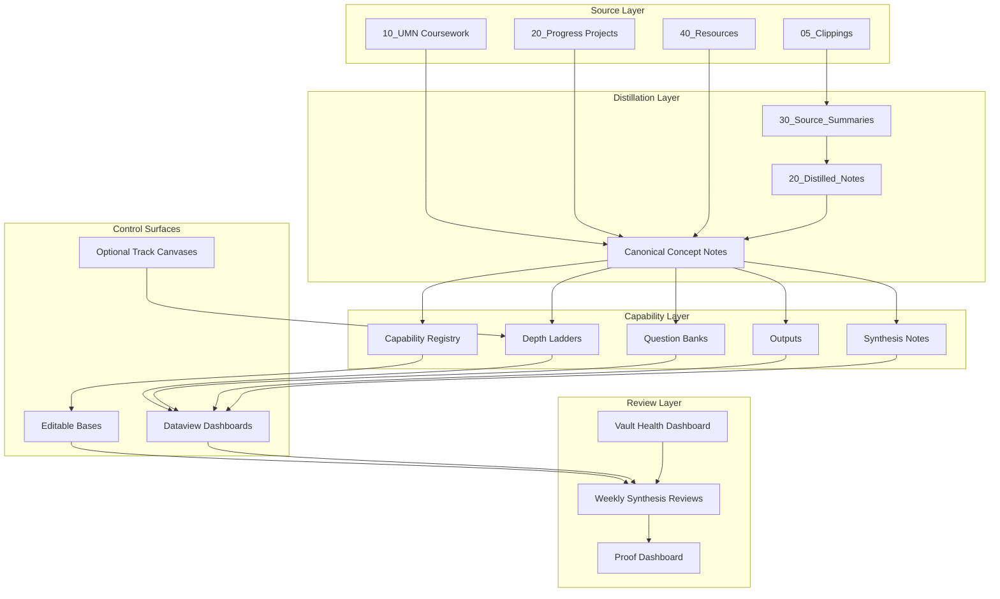

# Design Document: PKM Capability Engine for Jarvis

## Overview

Jarvis is not a blank-slate PKM vault. It already has a real operating system:

- `10_UMN/` for active coursework and concept formation
- `20_Progress/` for active projects, career work, mentorship, and UROP
- `40_Resources/` for durable reference knowledge
- `60_Claude/05_Clippings/` for raw web capture
- `60_Claude/20_Distilled_Notes/` and `30_Source_Summaries/` for AI-assisted distillation
- `60_Claude/60_Indexes/` for dashboards and retrieval

The goal of this design is not to add generic AI-PKM machinery. The goal is to make Jarvis compounding:

1. Capture high-signal material cleanly.
2. Distill it into durable notes.
3. Turn those notes into drills, projects, and outputs.
4. Use AI to accelerate retrieval, synthesis, and proof-building without turning the vault into note spam.

This revision improves the original Kiro draft in five important ways:

1. It aligns with the vault's real structure, schema, and operating documents.
2. It uses the tools that are actually enabled today.
3. It separates read-only analytics from editable control surfaces.
4. It adds a serious ingestion layer because Jarvis already has a heavy clipping workflow.
5. It avoids property and plugin assumptions that would conflict with the current vault.

## Ground Truth From the Current Vault

### Existing system documents

- `00_Dashboard.md` is the current control panel.
- `40_Resources/Obsidian/Vault Operating System.md` is the canonical schema contract.
- `AGENTS.md` defines agent editing boundaries.
- `CLAUDE.md` defines the Claude-layer workflow.
- `20_Progress/UROP/BOOM Board.md` and `20_Progress/UROP/index.md` are the best existing examples of "depth ladder" behavior in the vault.

### Current canonical schema

Jarvis already uses these durable fields:

- `type`
- `status`
- `created`
- `updated`
- `tags`
- `notes`
- `next`
- `area`
- `related_progress`
- `source_url`
- `input_kind`
- `thought_kind`
- `deadline`
- `reviewed`

The Capability Engine must extend this schema, not replace it.

### Plugin and runtime reality

Enabled today:

- Core plugins: `properties`, `bases`, `canvas`, `tag-pane`, `graph`, `backlinks`, `workspaces`, `publish`, `webviewer`
- Community plugins: `dataview`, `templater-obsidian`, `obsidian-local-rest-api`, `obsidian-tasks-plugin`, `url-into-selection`, `file-explorer-plus`, `recent-files-obsidian`

Installed but not currently enabled:

- `quickadd`
- `obsidian-spaced-repetition`
- `obsidian-git`
- `periodic-notes`
- `copilot`
- `obsidian-kanban`
- `obsidian-excalidraw-plugin`

Design implication:

- The system must work with `Properties + Dataview + Bases + Templater + Local REST API`.
- QuickAdd, Spaced Repetition, Git, and Periodic Notes are optional accelerators, not hard dependencies.

### Existing property conflict that must be respected

The vault currently has:

- `.obsidian/types.json` with `mastery` typed as a number
- legacy notes using `mastery (1/10)` as a numeric field

Design implication:

- Do **not** reuse `mastery` as a text enum.
- Use `mastery_level` for text progression.
- Keep `mastery_score` as an optional numeric field if a 1-10 scale is useful.

## Design Goals

### Primary goals

1. Capability over collection
   - Every important concept should become easier to explain, apply, test, and prove.

2. Retrieval over clutter
   - The engine should reduce search time, not create hundreds of thin notes.

3. Evidence over self-description
   - Jarvis should surface what you can demonstrate, not just what you have read.

4. Output over passive storage
   - Notes should feed portfolio bullets, interview stories, demos, briefs, and project work.

5. AI-safe operations
   - Agents should enrich and connect notes without rewriting raw sources or destabilizing mature notes.

6. Local-first durability
   - Markdown files, frontmatter, `.base` files, and optional `.canvas` files remain the source of truth.

### Anti-goals

1. No automatic mass-enrichment of the entire vault on day one.
2. No blind creation of hundreds of flashcards, questions, or synthesis notes.
3. No rewriting of files under `60_Claude/05_Clippings/`.
4. No hard dependency on plugins that are installed but disabled.
5. No design that treats AI output as correct unless it is linked to source notes or evidence.

## High-Level Architecture



## Core Design Decisions

### 1. Use two view types, not one

Jarvis should not rely on Dataview alone.

- `Dataview` is excellent for live analytics, dashboards, rollups, and derived views.
- `Bases` is better for editable registries, filtering, sorting, and triage of structured properties.

Design rule:

- Use `Dataview` inside Markdown dashboards.
- Use `.base` files for control surfaces where you need to edit metadata from a table or card view.

### 2. Keep Markdown notes as the source of truth

- Notes remain the durable canonical files.
- `.base` files and `.canvas` files are views over those files, not replacements.
- If a canvas is used, its cards should point to notes or files whenever the content matters long-term.

### 3. Treat coursework as the feeder layer, not the final layer

`10_UMN/` contains a large amount of your raw and semi-structured learning. The Capability Engine should not duplicate it. Instead:

- class and textbook notes feed concept notes
- concept notes feed drills and outputs
- outputs feed portfolio, interviews, and project leverage

### 4. Make outputs first-class

The previous draft correctly introduced outputs, but it did not place them well in the existing vault. Jarvis already has a Claude layer for generated artifacts, so output notes should live there.

### 5. Questions must be hybrid, not all separate notes

Not every question deserves its own file.

Use:

- a **Question Bank board** per track for prompts, misconceptions, and build drills
- a **durable question note** only when the question spans multiple sessions or blocks progress

This avoids file explosion.

### 6. AI roles should be portable

Do not hardcode the design around `.claude/skills/`.

The role model should work across:

- Kiro specs and prompts
- Codex using `AGENTS.md`
- Claude if you later choose to operationalize role prompts there

## Information Architecture

No new top-level folders are required. New content should fit the current vault shape.

```text
30_Order/Templates/
  Capability/
    Deep Dive Template.md
    Depth Ladder Template.md
    Question Bank Template.md
    Field OS Template.md
    Output Template.md
    Synthesis Template.md
    Clipping Distill Template.md

40_Resources/
  Capability/
    Capability Engine Guide.md
    Track Definitions.md
    Metadata Extension Guide.md

60_Claude/
  20_Distilled_Notes/
    Synthesis/
  45_Outputs/
  50_Reviews/
    Weekly Synthesis/
  60_Indexes/
    Capability Dashboard.md
    Question Dashboard.md
    Proof Dashboard.md
    Field OS/
      AI Field OS.md
      Systems Field OS.md
      Algorithms Field OS.md
      Career Field OS.md
      Trading Field OS.md
      AI Depth Ladder.md
      Systems Depth Ladder.md
      Algorithms Depth Ladder.md
      Career Depth Ladder.md
      Trading Depth Ladder.md
      AI Question Bank.md
      Systems Question Bank.md
      Algorithms Question Bank.md
      Career Question Bank.md
      Trading Question Bank.md
    Bases/
      Capability Registry.base
      Question Triage.base
      Output Pipeline.base
    Canvas/
      AI Map.canvas
      Systems Map.canvas
      Algorithms Map.canvas
      Career Map.canvas
      Trading Map.canvas
```

### Why this placement is better than the original draft

- `Field OS`, `Depth Ladder`, and `Question Bank` are operational dashboards, so they belong under `60_Claude/60_Indexes/`, not `20_Progress/`.
- Outputs belong in the Claude artifact layer, not as orphan note types with no destination.
- Synthesis notes are durable AI-built knowledge, so they fit under `60_Claude/20_Distilled_Notes/Synthesis/`.

## Track Model

The five tracks remain correct, but they should be defined against the actual vault:

### `ai`

Primary sources:

- `40_Resources/CS/AI/`
- AI-related clippings and distilled notes
- MCP, workflow, prompt, automation, and agent notes

### `systems`

Primary sources:

- `20_Progress/UROP/`
- Rust learning path
- backend, API, data flow, observability, Docker, Kafka, MongoDB notes

### `algorithms`

Primary sources:

- `10_UMN/CSCI 4041/`
- `10_UMN/CSCI 2041/`
- DSA, complexity, trees, OCaml, algorithmic reasoning notes

### `career`

Primary sources:

- `20_Progress/Career/`
- `20_Progress/Mentorship Program/`
- `20_Progress/Projects/Portfolio.md`
- internship search, project briefs, presentation stories

### `trading`

Primary sources:

- `40_Resources/Trading/`
- trading-related clippings
- market workflow and tooling notes

### Important note

`10_UMN/BIOL`, `MUS`, and `MGMT` are still valuable, but they are better treated as feeder knowledge or supporting context unless they directly support one of the five long-term capability tracks.

## Data Model

## Canonical extension fields

These fields are additive to the existing vault schema.

```yaml
track: []                # ai | systems | algorithms | career | trading
prerequisites: []        # wikilinks to concept prerequisites
used_in: []              # wikilinks to projects, boards, briefs, or implementations
evidence: []             # wikilinks to outputs, demos, writeups, talks, briefs
difficulty: null         # integer 1-5
mastery_level: null      # novice | familiar | proficient | expert
mastery_score: null      # optional integer 1-10
last_drilled: null       # date
next_drill: null         # date
drill_interval: null     # integer days
question_kind: null      # open | misconception | oral-exam | debugging | build
question_status: null    # open | active | resolved
output_kind: null        # for output notes only
source_concepts: []      # for output notes only
concepts: []             # for synthesis notes only
tracks: []               # for synthesis notes only
```

### Why `mastery_level` instead of `mastery`

Because Obsidian property types are global by property name, and this vault already types `mastery` as a number. Reusing `mastery` for text would create schema friction across the vault.

### Allowed value sets

#### `track`

- `ai`
- `systems`
- `algorithms`
- `career`
- `trading`

#### `mastery_level`

- `novice`
- `familiar`
- `proficient`
- `expert`

#### `output_kind`

- `portfolio-bullet`
- `blog-draft`
- `interview-story`
- `demo-spec`
- `project-brief`
- `reusable-prompt`

#### `question_kind`

- `open`
- `misconception`
- `oral-exam`
- `debugging`
- `build`

#### `question_status`

- `open`
- `active`
- `resolved`

## Note archetypes

### 1. Enriched concept note

Use on high-value concepts in:

- `40_Resources/CS/`
- `60_Claude/20_Distilled_Notes/`
- selected `10_UMN` concept notes
- selected `20_Progress/UROP` knowledge notes

```yaml
---
type: concept
status: seed
created: 2026-04-24
updated: 2026-04-24
tags:
  - concept
notes: []
track:
  - systems
prerequisites: []
used_in: []
evidence: []
difficulty: 3
mastery_level: novice
mastery_score: 4
last_drilled:
next_drill:
drill_interval: 10
---
```

### 2. Output note

Output notes are first-class artifacts and should live in `60_Claude/45_Outputs/`.

```yaml
---
type: output
status: seed
created: 2026-04-24
updated: 2026-04-24
tags:
  - output
track:
  - career
output_kind: interview-story
source_concepts:
  - "[[Learning/Observability and Tracing]]"
  - "[[API Work]]"
---
```

### 3. Durable question note

Only use a separate question note when the question persists across sessions or blocks progress.

```yaml
---
type: thought
status: seed
created: 2026-04-24
updated: 2026-04-24
tags:
  - question
track:
  - ai
question_kind: open
question_status: open
notes:
  - "[[Gen AI Roadmap]]"
---
```

### 4. Synthesis note

Synthesis notes live in `60_Claude/20_Distilled_Notes/Synthesis/`.

```yaml
---
type: evergreen
status: seed
created: 2026-04-24
updated: 2026-04-24
tags:
  - evergreen
  - synthesis
concepts:
  - "[[Rust Ownership]]"
  - "[[OCaml - Pattern Matching]]"
tracks:
  - systems
  - algorithms
---
```

## Deep Dive concept template

This is still the right core template, but it should be treated as a growth format, not a mandatory all-at-once document.

```markdown
---
type: concept
status: seed
created: {{date:YYYY-MM-DD}}
updated: {{date:YYYY-MM-DD}}
tags:
  - concept
notes: []
track: []
prerequisites: []
used_in: []
evidence: []
difficulty:
mastery_level: novice
mastery_score:
last_drilled:
next_drill:
drill_interval:
---

# {{title}}

## What It Is

## Why It Matters

## Mental Model

## Formal Model

## Real Example

## Implementation

## Failure Modes

## Interview Angle

## Related Projects

## Drill Cards

## Next Drill
```

### Growth rule

- `seed`: definition, why it matters, one example
- `sprout`: mental model, implementation, one failure mode
- `tree`: formal model, interview angle, related projects, drill cards, evidence

This is better than requiring every section immediately.

## Dashboards and control surfaces

## Global dashboards

### `Capability Dashboard.md`

Purpose:

- global count of tracked concepts
- mastery distribution
- overdue drills
- recently enriched notes
- notes missing evidence

Use `Dataview`.

### `Question Dashboard.md`

Purpose:

- open durable questions by track
- misconceptions not yet resolved
- debugging prompts backlog

Use `Dataview`.

### `Proof Dashboard.md`

Purpose:

- outputs produced by track
- concepts with no evidence
- interview stories, portfolio bullets, demos in progress

Use `Dataview`.

## Per-track boards

Each track gets three boards:

1. `Field OS`
2. `Depth Ladder`
3. `Question Bank`

### Field OS

This is the track control center.

Sections:

- capability summary
- overdue drills
- recent progress
- open questions
- outputs produced
- synthesis notes touching this track
- links to the track's depth ladder and question bank

### Depth Ladder

This should explicitly copy the successful UROP BOOM Board pattern:

- core concepts
- 30-minute refresher
- 2-hour technical refresher
- deep relearning pass
- overdue drills
- all tracked concepts

Important:

- refresher sequences are curated, not auto-generated
- Dataview sections only surface the queue

### Question Bank

Each track bank should include:

- open questions
- misconceptions
- oral exam prompts
- debugging drills
- build prompts
- resolved learnings worth keeping

The Question Bank is a board, not a dump. AI should append to it selectively.

## Bases strategy

Because Bases is enabled in Obsidian, Jarvis should use three `.base` files as editable registries:

### `Capability Registry.base`

Use for:

- all tracked concept notes
- sorting by `difficulty`, `mastery_level`, `next_drill`
- editing `track`, `mastery_level`, `drill_interval`

### `Question Triage.base`

Use for:

- durable question notes
- filtering by `track`, `question_kind`, `question_status`
- clearing stale questions during weekly review

### `Output Pipeline.base`

Use for:

- all `type: output` notes
- tracking `status`, `output_kind`, `track`
- moving outputs from `seed` to `draft` to `published`

### Why this matters

Dataview is display-oriented. Bases gives you editable database-like views over the same Markdown notes. That makes it the better tool for triage and metadata maintenance.

## Canvas strategy

Canvas should be optional and narrowly used.

Recommended uses:

- per-track mental maps
- interview story maps
- system architecture maps for UROP, backend, and AI pipelines

Guardrails:

- use file cards for anything durable
- do not treat free-floating text cards as the long-term source of truth
- canvases support understanding; notes remain canonical

## Ingestion pipeline

This is the most important addition missing from the original draft.

Jarvis already has a large clipping layer. Without a better ingestion contract, the capability system will drown in noisy inputs.

## Clipping stages

### Stage 1: Raw capture

Destination:

- `60_Claude/05_Clippings/`

Rules:

- raw clips are immutable
- every clip should have `source_url`
- use `type: input`
- assign `track` when obvious

### Stage 2: Source-grounded summary

Destination:

- `60_Claude/30_Source_Summaries/`

Rules:

- summarize claims, examples, actions, and open questions
- preserve source lineage
- link to relevant concepts, projects, or track boards

### Stage 3: Durable concept or output

Destination:

- `40_Resources/` or `60_Claude/20_Distilled_Notes/` for durable knowledge
- `60_Claude/45_Outputs/` for artifacts

Rules:

- only create a durable note if the information is reusable
- otherwise keep it as a source summary

## Web Clipper recommendation

Use Obsidian Web Clipper templates with site rules for at least four intake types:

1. AI research / tooling
2. internship or career opportunities
3. trading tools or market theses
4. class or textbook support resources

Target metadata:

```yaml
type: input
status: seed
created: {{date}}
updated: {{date}}
source_url: {{url}}
track: []
input_kind: article
notes: []
tags:
  - clipping
```

This is a major leverage point because your vault already captures a lot from the web.

## Capability loop

Every high-value concept should be able to travel this loop:

```text
source -> summary -> concept -> drill -> project usage -> output -> evidence -> interview/portfolio leverage
```

If a note cannot enter this loop, it should remain a source summary or supporting note instead of being promoted.

## Drill model

The drill system must not depend on the Spaced Repetition plugin being enabled.

### Source of truth

- `last_drilled`
- `next_drill`
- `drill_interval`
- optional `## Drill Cards` section inside the concept note

### Compatibility rule

If you later enable Spaced Repetition:

- add `#cards` to drill-card-heavy notes
- use `::` separators inside `## Drill Cards`

But the scheduling logic still lives in frontmatter so the system works even without the plugin.

### Default interval by difficulty

| Difficulty | Default interval |
|---|---|
| 1 | 21 days |
| 2 | 14 days |
| 3 | 10 days |
| 4 | 7 days |
| 5 | 5 days |

### Mastery multipliers

| Mastery level | Multiplier |
|---|---|
| novice | 1.0 |
| familiar | 1.25 |
| proficient | 1.6 |
| expert | 2.0 |

### Scheduling rule

`next_drill = last_drilled + clamp(round(drill_interval * mastery_multiplier), 3, 180)`

This is intentionally simple and maintainable.

## Output system

Outputs are where Jarvis stops being a note vault and becomes a competitive advantage.

## Output categories

### `portfolio-bullet`

Use when a concept has been demonstrated in a project, research effort, or implementation.

### `interview-story`

Use when a concept has a strong problem-action-result narrative.

### `demo-spec`

Use when the concept can become a mini build, walkthrough, or proof artifact.

### `project-brief`

Use when knowledge should be turned into an execution note or planning artifact.

### `blog-draft`

Use when the concept is teachable and differentiated.

### `reusable-prompt`

Use when the concept is best operationalized as an agent workflow or instruction pattern.

## Output gate

An output should usually require at least one of:

- `mastery_level >= familiar`
- a linked project under `used_in`
- a linked artifact under `evidence`

This prevents output spam.

## Cross-domain synthesis

Synthesis is one of the highest-value features, but it should be selective.

Good synthesis notes:

- bridge at least two tracks
- help you explain or build better
- reveal transfer between domains

Examples grounded in this vault:

- Rust ownership vs OCaml immutability
- Kafka pipelines vs agent tool orchestration
- observability in backend systems vs evaluation in AI systems
- management strategy vs product and project prioritization

Bad synthesis notes:

- vague similarity-only comparisons
- auto-generated pairings with no practical use

## AI role model

These are prompt roles, not required file paths.

### Teacher

Expands concept notes:

- what it is
- why it matters
- mental model
- formal model

### Examiner

Adds:

- oral exam prompts
- drill cards
- debugging drills
- misconception checks

### Builder

Adds:

- implementation examples
- related projects
- demo specs
- output candidates

### Connector

Adds:

- prerequisites
- used_in
- synthesis candidates
- cross-track links

### Critic

Reviews:

- weak explanations
- missing evidence
- hand-wavy outputs
- notes with no practical leverage

### Operational rule

Agent roles should first be implemented as prompt patterns in:

- `.kiro/specs/`
- `AGENTS.md`
- optional reusable prompts in `60_Claude/45_Outputs/` or `40_Resources/Capability/`

Only later, if useful, should they be formalized into `.claude/skills/` or other agent-specific infrastructure.

## Migration plan

The original draft was conceptually strong but too eager to build everything at once. Jarvis needs a staged rollout.

### Phase 0: Schema hardening

1. Update `Vault Operating System.md` to explicitly include:
   - `type: output`
   - new capability fields
2. Update `.obsidian/types.json`
3. Add capability templates under `30_Order/Templates/Capability/`

### Phase 1: Control surfaces

Create:

- `Capability Dashboard.md`
- `Question Dashboard.md`
- `Proof Dashboard.md`
- five Field OS boards
- five Depth Ladders
- five Question Banks
- three `.base` files

### Phase 2: Seed the engine with flagship notes

Enrich 20-30 notes first, not the whole vault.

Recommended first wave:

- UROP / BOOM systems notes
- AI workflow, MCP, and Gen AI notes
- CSCI 4041 and CSCI 2041 core concepts
- career and portfolio notes
- highest-value trading notes

### Phase 3: Output pass

Generate:

- interview stories from UROP
- portfolio bullets from projects and systems notes
- reusable prompts from AI workflow notes
- project briefs from high-signal concept clusters

### Phase 4: Weekly synthesis cadence

Add weekly review notes under:

- `60_Claude/50_Reviews/Weekly Synthesis/`

Each weekly synthesis should include:

- concepts enriched this week
- overdue drills
- unresolved questions
- outputs created
- 1-3 synthesis candidates worth pursuing

## Success criteria

The Capability Engine is successful when:

1. Each track has one functioning Field OS board, one Depth Ladder, and one Question Bank.
2. At least 25 high-value notes have `track`, `difficulty`, `mastery_level`, and drill fields.
3. At least 10 output notes exist with real provenance from source concepts.
4. The weekly synthesis review can identify overdue drills and evidence gaps without manual searching.
5. The system helps convert coursework and research notes into project, interview, and portfolio leverage.

## Failure modes and guardrails

### Failure mode 1: File explosion

Cause:

- every prompt, question, or synthesis candidate becomes a note

Guardrail:

- use boards first, separate files only for durable items

### Failure mode 2: Metadata drift

Cause:

- inconsistent field names and property types

Guardrail:

- update `.obsidian/types.json`
- use `Properties view` for governance
- use the Vault Health Dashboard to surface drift

### Failure mode 3: Output without proof

Cause:

- writing bullets and stories detached from real evidence

Guardrail:

- every output must link back to `source_concepts`
- concepts should link forward to `evidence`

### Failure mode 4: AI clutter

Cause:

- agents generating too many notes with low signal

Guardrail:

- enforce "search before create"
- enrich existing notes first
- prefer patching by heading

### Failure mode 5: Overdependence on disabled plugins

Cause:

- building around QuickAdd or Spaced Repetition before they are enabled

Guardrail:

- design first around currently enabled plugins

## Dependencies

### Required now

- Obsidian Properties
- Obsidian Bases
- Obsidian Canvas
- Dataview
- Templater
- Obsidian Local REST API
- Tasks plugin

### Optional later

- QuickAdd
- Spaced Repetition
- Periodic Notes
- Obsidian Git

## Research basis

This design is grounded in current tool behavior and in the actual Jarvis vault.

- Obsidian Properties: global property types and structured metadata are first-class, so schema design must avoid conflicting meanings per property name.
- Obsidian Properties view: property governance is easier when names and types are normalized across the vault.
- Obsidian Bases: editable database-like views are better than Dataview for triage and metadata maintenance.
- Dataview: great for display and aggregation, not for editing, so it should power dashboards rather than serve as the only control surface.
- Obsidian Canvas: useful as a visual overlay, but note/file cards should be preferred for durable knowledge because text cards do not participate in backlinks.
- Obsidian Web Clipper: strong template and rule support makes it the right upstream tool for cleaning the clipping-heavy intake already present in Jarvis.

## References

- Obsidian Properties: https://help.obsidian.md/properties
- Obsidian Properties view: https://help.obsidian.md/plugins/properties
- Obsidian Bases: https://help.obsidian.md/bases
- Obsidian Bases syntax: https://help.obsidian.md/bases/syntax
- Obsidian Canvas: https://help.obsidian.md/plugins/canvas
- Obsidian Web Clipper: https://obsidian.md/help/web-clipper
- Obsidian Web Clipper capture behavior: https://obsidian.md/help/web-clipper/capture
- Dataview overview: https://blacksmithgu.github.io/obsidian-dataview/
- Dataview metadata on pages: https://blacksmithgu.github.io/obsidian-dataview/annotation/metadata-pages/
- Dataview data types: https://blacksmithgu.github.io/obsidian-dataview/annotation/types-of-metadata/
- Dataview sources: https://blacksmithgu.github.io/obsidian-dataview/reference/sources/

## Final recommendation

The Capability Engine should be implemented as a layered upgrade to the existing Jarvis OS:

1. strengthen ingestion
2. enrich only the most strategic notes
3. add track dashboards and editable registries
4. create an evidence-first output layer
5. review weekly for synthesis and drift

That approach is much more likely to make Jarvis genuinely compounding than a generic "AI second brain" rollout that creates a lot of structure but little advantage.
