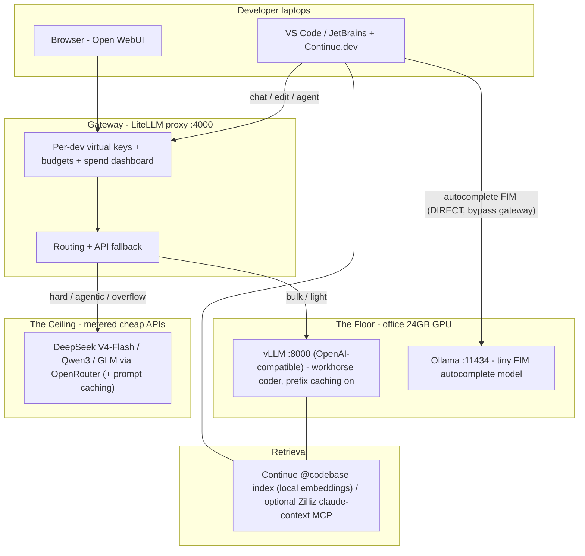

# Architecture & Setup Runbook — 24GB Hybrid "Own the Floor, Rent the Ceiling" Stack

> Companion to the [[Research Dossier — Internal LLM Inference at Near-Zero Cost|research dossier]]. Target: ~15-40 engineers, one already-owned ~24GB GPU (RTX 3090/4090-class), hybrid APIs allowed. Every design choice traces to the dossier's evidence; section refs like [D§3] point there.
>
> Assumptions (stated, change as needed): Ubuntu 22.04/24.04 server, recent NVIDIA driver + CUDA, Docker + NVIDIA Container Toolkit, the box is reachable only on the office LAN/VPN (not the public internet). Replace `SERVER_IP`, domains, and keys with your own.

---

## 1. Architecture at a glance



Three rules this encodes (all from [D§0, D§3]):
1. **Floor:** vLLM serves the workhorse coder for the high-volume chat/edit work; a tiny FIM model serves autocomplete.
2. **Ceiling:** hard/agentic tasks route to cheap APIs — because the best *fittable* open models still trail frontier closed models by ~7-13 pts on SWE-bench [D§7 risk 5].
3. **Gateway:** LiteLLM is the one control plane for keys, budgets, routing, and observability — **except** autocomplete, which must talk to Ollama directly (FIM-through-LiteLLM is broken, issue #6900) [D§7 risk 4].

---

## 2. VRAM budget — the single most important sizing decision

A 24GB card cannot comfortably hold a 30B workhorse *and* a second resident model *and* a large KV cache. Pick one profile:

| Profile | Workhorse (vLLM) | Weights | KV-cache headroom (~24GB - weights - ~1.5GB overhead) | Autocomplete | Verdict |
|---|---|---|---|---|---|
| **A — Balanced (recommended)** | Devstral-Small-2507 Q4_K_M | ~14.3GB | ~8GB → healthy concurrency | qwen2.5-coder:1.5b via Ollama (~1.3GB) | Best for 15-40 devs; most KV room |
| **B — Max quality** | Qwen2.5-Coder-32B Q4_K_M | ~19.9GB | ~2.5GB → low concurrency, ctx ≤8K | autocomplete on CPU (llama.cpp) | Single deep user; weak under team load |
| **C — Fast agentic** | Qwen3-Coder-30B-A3B Q4 | ~18.6GB | ~4GB → moderate, MoE decode is fast | qwen2.5-coder:1.5b (tight; lower vLLM util to 0.80) | Good if agentic/tool-calling dominates |

Footprints + scores: [D§4]. **Start with Profile A.** It leaves the most KV cache, which is what determines how many engineers you can serve at once [D§7 risk 6].

> Reserve VRAM for autocomplete by capping vLLM: `--gpu-memory-utilization 0.82` (Profile A) leaves room for the Ollama FIM model on the same card. If concurrency suffers, move autocomplete to CPU and raise utilization to 0.90.

---

## 3. Prerequisites (host)

```bash
# Verify GPU + driver
nvidia-smi

# Docker + NVIDIA Container Toolkit (so containers see the GPU)
sudo apt-get update && sudo apt-get install -y docker.io docker-compose-plugin
sudo apt-get install -y nvidia-container-toolkit
sudo nvidia-ctk runtime configure --runtime=docker
sudo systemctl restart docker

# Sanity check GPU is visible inside a container
docker run --rm --gpus all nvidia/cuda:12.4.0-base-ubuntu22.04 nvidia-smi
```

Confirm `llmfit --memory=24G` (or `whichllm`) agrees with the model choice before downloading weights [D§4].

---

## 4. The Floor — vLLM (workhorse) + Ollama (autocomplete)

### 4a. vLLM serving engine
vLLM is the production standard [D§7]; PagedAttention + continuous batching are why one card can serve a team [D§3.6, D§3.2].

```bash
# Profile A: Devstral-Small-2507, OpenAI-compatible API on :8000
docker run -d --name vllm --gpus all -p 8000:8000 \
  -v ~/models:/root/.cache/huggingface \
  --ipc=host \
  vllm/vllm-openai:latest \
  --model mistralai/Devstral-Small-2507 \
  --served-model-name devstral-coder \
  --gpu-memory-utilization 0.82 \
  --max-model-len 32768 \
  --enable-prefix-caching            # KV reuse on repeated prefixes [D§6]
```

Key flags and why:
- `--enable-prefix-caching` — 5-10× TTFT reduction on shared prefixes (system prompts, repo context) [D§6].
- `--max-model-len` — cap context to protect KV cache; lower it if concurrency degrades [D§7 risk 6].
- `--max-num-seqs N` — hard ceiling on in-flight requests; tune down if you see preemption/recompute in logs [D§7 risk 6].
- On startup, vLLM logs `Maximum concurrency for X tokens per request` — **read this number**; it is your real concurrent-user budget.

### 4b. Ollama — autocomplete (FIM) only
```bash
docker run -d --name ollama --gpus all -p 11434:11434 \
  -v ~/ollama:/root/.ollama ollama/ollama
docker exec ollama ollama pull qwen2.5-coder:1.5b   # FIM-trained, <10B [D§4]
```
Autocomplete models must be FIM-trained; Continue recommends `qwen2.5-coder:1.5b` (or Codestral) [D§4]. **Continue will talk to this directly** (Section 7), not via LiteLLM.

---

## 5. The Gateway — LiteLLM proxy

LiteLLM gives every dev a virtual key with a budget, routes chat/agent traffic, and falls back to APIs [D§2 pattern]. **Pin the version and use the official image** — the March 2026 PyPI supply-chain incident only hit `pip` installs, not `ghcr.io/berriai/litellm` [D§7 risk 9].

`litellm-config.yaml`:
```yaml
model_list:
  # --- The floor (local vLLM) ---
  - model_name: coder-local            # cheap default for bulk work
    litellm_params:
      model: openai/devstral-coder
      api_base: http://SERVER_IP:8000/v1
      api_key: "none"

  # --- The ceiling (metered APIs) ---
  - model_name: coder-strong           # hard / agentic escalation
    litellm_params:
      model: openrouter/deepseek/deepseek-chat   # routes to V4-Flash $0.14/$0.28 [D§5]
      api_key: os.environ/OPENROUTER_API_KEY

router_settings:
  routing_strategy: simple-shuffle
  # If coder-local errors/times out, fall back to the API tier:
  fallbacks: [{"coder-local": ["coder-strong"]}]

litellm_settings:
  drop_params: true
  success_callback: ["prometheus"]     # observability [D§7]

general_settings:
  master_key: os.environ/LITELLM_MASTER_KEY
  database_url: os.environ/DATABASE_URL   # Postgres, for keys/budgets/spend
```

```bash
docker run -d --name litellm -p 4000:4000 \
  -v $(pwd)/litellm-config.yaml:/app/config.yaml \
  -e LITELLM_MASTER_KEY=sk-master-XXXX \
  -e OPENROUTER_API_KEY=sk-or-XXXX \
  -e DATABASE_URL=postgresql://... \
  ghcr.io/berriai/litellm:v1.83.0-stable \   # PIN a known-good tag, never :latest [D§7 risk 9]
  --config /app/config.yaml
```

Create per-dev virtual keys with budgets (one click to revoke a leaver):
```bash
curl -X POST http://SERVER_IP:4000/key/generate \
  -H "Authorization: Bearer sk-master-XXXX" -H "Content-Type: application/json" \
  -d '{"models":["coder-local","coder-strong"],"max_budget":50,"budget_duration":"30d","metadata":{"user":"alice"}}'
```

> **Routing note:** the config above does *cost-cheap-by-default + fallback-on-failure*. True quality-aware routing (send only hard prompts to the API) is the RouteLLM/FrugalGPT pattern [D§3.1, D§3.5]; start simple (devs pick `coder-local` vs `coder-strong`, or the agent does), add a semantic router later if API spend climbs.

---

## 6. Frontend A — Open WebUI (browser chat, zero laptop install)

```yaml
# docker-compose snippet
services:
  open-webui:
    image: ghcr.io/open-webui/open-webui:main
    ports: ["3000:8080"]
    environment:
      - OPENAI_API_BASE_URL=http://SERVER_IP:4000/v1   # point at LiteLLM
      - OPENAI_API_KEY=sk-master-XXXX
      - DEFAULT_USER_ROLE=pending     # new signups need admin approval [D§7]
      - ENABLE_SIGNUP=false
    volumes: ["open-webui:/app/backend/data"]
```
Harden per the dossier: `pending` default role, signups off, behind VPN/reverse-proxy, keep it patched (v0.9.6 was a security release) [D§7].

---

## 7. Frontend B — Continue.dev (IDE) with the FIM bypass

The critical wiring: **chat/edit/agent → LiteLLM; autocomplete → Ollama directly** (issue #6900) [D§7 risk 4].

`~/.continue/config.yaml` (shared template, devs fill their own key):
```yaml
models:
  - name: Coder (local)
    provider: openai
    model: coder-local
    apiBase: http://SERVER_IP:4000/v1     # via LiteLLM
    apiKey: ${env:LITELLM_VIRTUAL_KEY}
    roles: [chat, edit, apply]

  - name: Coder (strong, API)
    provider: openai
    model: coder-strong
    apiBase: http://SERVER_IP:4000/v1     # via LiteLLM -> API ceiling
    apiKey: ${env:LITELLM_VIRTUAL_KEY}
    roles: [chat, edit]

  - name: Autocomplete
    provider: ollama                       # DIRECT to Ollama - do NOT proxy FIM
    model: qwen2.5-coder:1.5b
    apiBase: http://SERVER_IP:11434
    roles: [autocomplete]

  - name: Embeddings
    provider: ollama
    model: nomic-embed-text
    apiBase: http://SERVER_IP:11434
    roles: [embed]                         # powers @codebase retrieval [D§6]

context:
  - provider: codebase                     # retrieve top-k chunks, not whole repo [D§6]
```
Disable Copilot's inline completions to avoid conflict; turn Continue telemetry off.

---

## 8. Retrieval / token control (kill the token wall)

Layered, cheapest-first [D§6]:
1. **vLLM prefix caching** — already on (`--enable-prefix-caching`); reuses KV for repeated system prompts/context.
2. **Continue `@codebase`** — local embeddings index, returns ~5 relevant chunks instead of full files (`nRetrieve` 25 → rerank → `nFinal` 5).
3. **Prompt caching on the ceiling** — when routing to DeepSeek/Anthropic/Gemini, structure prompts static-first so cached input is ~90% cheaper [D§6].
4. **(Optional) Zilliz `claude-context` MCP** — repo-wide hybrid (BM25+dense) code search via Milvus; ~40% token + ~36% tool-call reduction for agentic flows [D§6].
5. **(Optional) Dify** — only if you want a no-code RAG/workflow app layer for non-engineers; it's a separate Docker deployment [D§7].

---

## 9. Networking & security

- **Do not expose any port to the public internet.** Keep the box on LAN/VPN; put a reverse proxy (Caddy/nginx) with TLS in front of Open WebUI + LiteLLM for the office network.
- **LiteLLM = credential blast radius.** Pin the image tag, use the official `ghcr.io` image, store provider keys in env/secrets, scope per-dev virtual keys with budgets [D§7 risk 9].
- **Open WebUI:** `DEFAULT_USER_ROLE=pending`, `ENABLE_SIGNUP=false`, keep current.
- **Data policy:** sensitive projects → force `coder-local` (never routes off-box); non-sensitive → allow `coder-strong` escalation. This is how "hybrid allowed" stays safe.

---

## 10. Observability & capacity

- LiteLLM `prometheus` callback → Grafana for per-dev spend, QPS, latency; set **spend alerts at 80% of budget from day 1** [D§7 risk 2].
- Watch vLLM's startup `Maximum concurrency` line and the preemption/recompute counters [D§7 risk 6].
- **Scale trigger:** if p95 TTFT for chat creeps past your comfort threshold (or vLLM logs frequent preemption) at peak, that is the signal to (a) shrink the workhorse to a faster MoE, (b) shift more traffic to the API ceiling, or (c) add a second GPU — *not* before [D§5].
- **Single GPU = single point of failure:** the LiteLLM API fallback (Section 5) means a GPU outage *degrades* to API rather than stopping the team [D§7 risk 8].

---

## 11. Rollout phases

1. **Day 1-2 — Floor up.** Confirm model fit (`llmfit`), run vLLM + Ollama, smoke-test from one laptop.
2. **Week 1 — Gateway + frontends.** LiteLLM with Postgres, per-dev keys, Open WebUI, Continue config pushed to the team. Disable Copilot inline.
3. **Week 2 — Retrieval + ceiling.** Turn on `@codebase`, wire the API overflow tier with a $200 cap + alerts, document the sensitive-vs-non-sensitive routing rule.
4. **Month 2 — Tune & decide.** Use real spend/latency data to decide subscriptions-vs-hybrid per the honest TCO [D§5]; only then consider cancelling seats or adding a GPU.

---

## 12. Verification commands

```bash
# 1. vLLM serving (floor)
curl http://SERVER_IP:8000/v1/chat/completions -H "Content-Type: application/json" \
  -d '{"model":"devstral-coder","messages":[{"role":"user","content":"write a python fizzbuzz"}]}'

# 2. Ollama FIM autocomplete (direct)
curl http://SERVER_IP:11434/api/generate \
  -d '{"model":"qwen2.5-coder:1.5b","prompt":"def add(a, b):\n    return ","stream":false}'

# 3. LiteLLM gateway with a virtual key
curl http://SERVER_IP:4000/v1/chat/completions \
  -H "Authorization: Bearer sk-virtual-alice" -H "Content-Type: application/json" \
  -d '{"model":"coder-local","messages":[{"role":"user","content":"hi"}]}'

# 4. API fallback path
curl http://SERVER_IP:4000/v1/chat/completions \
  -H "Authorization: Bearer sk-virtual-alice" -H "Content-Type: application/json" \
  -d '{"model":"coder-strong","messages":[{"role":"user","content":"hi"}]}'

# 5. Confirm prefix caching + concurrency in vLLM logs
docker logs vllm 2>&1 | grep -i "prefix\|Maximum concurrency"

# 6. Open WebUI reachable
curl -I http://SERVER_IP:3000
```
In-IDE checks: Continue chat returns from `coder-local`; tab autocomplete fires (proves the Ollama-direct FIM path); `@codebase` returns repo-relevant chunks.

---

## 13. What this deliberately does NOT claim
- It is **not** "free." Budget electricity (~$60-90/mo), API overflow (~$200/mo), monitoring, and part-time maintenance; at 15-40 seats this can rival or exceed a Copilot Business bill once labor is priced [D§5]. The justification is **data control + no per-seat scaling + token-wall removal + a hybrid that keeps the API bill tiny** — not a $0 invoice.
- It does **not** put a 70B model on one 24GB card, and does **not** rely on AirLLM for team serving [D§0, D§4].
