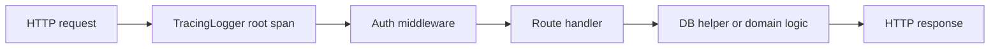

# API Work
This note is the cleaned project journal for the API side of the BOOM UROP work.
## What This Note Records
This note is about what you changed, tested, and learned in the API layer. It is not the generic backend theory note. For the conceptual version, see [[API and Backend]].
## Scope
The API work mainly covered:
- request-level tracing
- authentication tracing
- database startup visibility
- startup and configuration clarity
- route-level instrumentation
- manual endpoint testing with Postman and curl
## BOOM Files Most Relevant To This Work
- `src/bin/api.rs`
- `src/api/auth.rs`
- `src/api/db.rs`
- `src/api/docs.rs`
- `src/api/routes/auth.rs`
- `src/api/routes/catalogs.rs`
- `src/api/routes/filters.rs`
- `src/api/routes/info.rs`
- `src/api/routes/kafka.rs`
- `src/api/routes/users.rs`
## What Changed In Practical Terms
### Request tracing became first-class
The API was wired so that each incoming HTTP request gets a root tracing span. That changed the debugging model from:
- isolated log lines
to:
- one request tree with nested spans underneath it
### Authentication became diagnosable
You added visibility around:
- token creation
- token validation
- token decoding
- authenticated user lookup
That matters because auth failures can otherwise look like route or database failures.
### Database startup became less opaque
The API startup path became easier to reason about by tracing:
- database initialization
- admin bootstrap behavior
- config-dependent startup decisions

From the actual API entrypoint, the startup path is:

1. load `.env`
2. initialize tracing
3. load `AppConfig`
4. build DB state
5. build auth state
6. create email service
7. register routes

That made this work more than a route-level change. It made startup behavior observable too.
### Route handlers became easier to inspect
By instrumenting route handlers, you made it easier to answer:

- which endpoint ran
- under which auth context
- with which request parameters

## Request Flow To Memorize



## Main Debugging Story

### Malformed bearer token

Problem:

- the request sent `Authorization: Bearer <token>`

Observed failure:

- Base64 decoding error during token decode

Why this was useful:

- the trace made it clear the failure happened in the auth path
- that ruled out route logic and MongoDB very quickly
- the bug was request formatting, not deeper application logic

This is a concrete example of observability paying off.

## What The Website Added To This Story

The presentation site turned the API work into a clearer narrative:

- the Trace Explorer shows the request tree
- the Postman Evidence section shows the request side-by-side with the trace
- the Failure Gallery turns the malformed header issue into a diagnosis example rather than just a bug anecdote

## Practical Testing Loop

Your most reliable manual loop for API work was:

1. start the API with tracing enabled
2. authenticate with Postman or curl
3. hit a protected route
4. compare request behavior to the trace output
5. decide whether the problem is auth, route handling, DB, or environment

## Command Recipes

### Run the API with tracing

```bash
cd ~/projects/boom
RUST_LOG=info,boom=debug OTEL_EXPORTER_OTLP_ENDPOINT=http://localhost:4317 cargo run --bin api
```

### Authenticate with curl

```bash
curl -X POST http://127.0.0.1:4000/api/auth \
  -H "Content-Type: application/x-www-form-urlencoded" \
  -d "username=admin&password=admin"
```

### Hit a protected route

```bash
curl http://127.0.0.1:4000/api/catalogs \
  -H "Authorization: Bearer <token>"
```

### Search route handlers

```bash
rg -n "#\\[.*(get|post|patch|delete)" src/api/routes
```

### Search auth and instrumentation paths

```bash
rg -n "authenticate|validate_token|decode_token|TracingLogger|instrument" src/api src/bin/api.rs
```

## Screenshot Placeholders

- [ ] API startup logs showing tracing and DB initialization
- [ ] `POST /api/auth` request in Postman
- [ ] terminal trace for `/api/auth`
- [ ] `GET /api/catalogs` request in Postman
- [ ] terminal trace for `/api/catalogs`
- [ ] one auth failure trace showing where the request died
## Engineering Takeaways
- Good backend work includes startup, middleware, auth, docs, and testability.
- Tracing is most valuable at layer boundaries: request to middleware, middleware to auth, handler to DB.
- A reproducible manual test flow is part of backend engineering, not an optional extra.
## Related Notes
- [[API and Backend]]
- [[Observability and Tracing]]
- [[Postman]]
- [[Logs]]
## Data view
### UROP notes that reference this work
```dataview
TABLE type, status, file.folder
FROM "20_Progress/UROP"
WHERE file.path != this.file.path
AND contains(file.outlinks, this.file.link)
SORT file.folder ASC, file.name ASC
```
