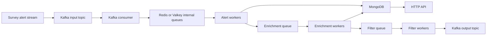

# BOOM
BOOM stands for **Burst and Outburst Observations Monitor**.
At a systems level, BOOM is a Rust-based astronomical alert broker. It receives survey alert packets, moves them through a staged backend pipeline, enriches and filters them, stores the results, and exposes those results through an API and downstream streams.
## Why This Note Matters
This is the foundation note. If you cannot explain BOOM clearly, the rest of the project gets harder to understand.
Use this note to answer:
- What is an alert?
- What problem is BOOM solving?
- What does BOOM record?
- Which subsystems matter most?
## BOOM In One Sentence
Surveys detect that something in the sky changed; BOOM receives that candidate event, adds context, decides whether it is interesting, stores it, and makes it available for follow-up and analysis.
## What The Alert Actually Is
An alert in BOOM is not a user notification first. It is a machine-readable packet from a sky survey saying:
- something at this sky position appears new, changed, or otherwise interesting
Examples of what may trigger a survey alert:
- a supernova candidate brightening
- a variable star changing brightness
- an active galactic nucleus flare
- a moving object
- an artifact or false positive that still has to be processed
The alert is a candidate signal, not the final scientific answer.
## What Problem BOOM Solves
Raw survey streams are too large and too noisy to consume directly. BOOM exists to:
1. ingest those streams reliably
2. normalize survey-specific data into BOOM's internal model
3. enrich alerts with cross-matches, derived fields, and model outputs
4. run filters that decide which alerts matter to users
5. store the results in a queryable system
6. expose those results through an API and output streams
This means BOOM is solving two linked problems:
- a scale problem: surveys emit too many raw alerts for humans to inspect directly
- a decision problem: different users care about different kinds of events
That is why BOOM is not just a Kafka script and not just a web API. It is a staged decision-making system.
## End-to-End System View

## What BOOM Stores
Depending on stage and survey, BOOM stores:
- raw alert metadata
- source and candidate identifiers
- coordinates and photometry
- image cutouts
- object-level records
- enrichment fields
- classification results
- filter definitions and versions
- filter pass or fail outputs
This is why BOOM is more than a pass-through broker. It is also a storage, enrichment, and query system.
## Main Subsystems
### Alert ingestion
Purpose:
- decode survey packets
- normalize them
- split them into useful internal records
- enqueue downstream work
Key code:
- `src/alert/*`
The docs and README make a useful distinction here:
- Kafka consumers move packets from the external stream into BOOM's internal queueing layer
- alert ingestion workers are where BOOM starts turning those packets into BOOM-shaped records
### Kafka
Purpose:
- receive input survey streams
- publish outputs for downstream consumers
Key code:
- `src/bin/kafka_consumer.rs`
- `src/bin/kafka_producer.rs`
- `src/kafka/*`
Kafka appears on both sides of BOOM:
- input side: survey streams arrive through Kafka topics
- output side: filtered alerts can be published again for downstream consumers
### Redis or Valkey queues
Purpose:
- decouple ingestion from processing
- provide simple internal handoff between pipeline stages
Related note:
- [[Kafka Redis and Workers]]
The architecture docs explain why Redis or Valkey exists alongside Kafka:
- it is fast and simple for internal task passing
- it is easier to reason about for worker handoff
- it avoids forcing every internal transition through the public stream layer
### Scheduler and workers
Purpose:
- run alert, enrichment, and filter workers
- manage lifecycle, heartbeat, and shutdown
Key code:
- `src/bin/scheduler.rs`
- `src/scheduler/*`
From the scheduler source, this subsystem is responsible for:
- parsing CLI arguments such as survey and config path
- initializing survey-specific MongoDB indexes
- spawning alert, enrichment, and filter worker pools
- logging heartbeat information with live worker counts
- shutting down gracefully on `CTRL+C`
### MongoDB
Purpose:
- store alerts, objects, cutouts, enrichment fields, and filter data
Key code:
- `src/api/db.rs`
- `src/filter/*`
- survey-specific alert and enrichment code
The architecture docs also call out an important storage design detail:
- BOOM does not blindly dump Rust structs into MongoDB
- it serializes to BSON and sanitizes document shape to avoid null-heavy storage
### API
Purpose:
- authentication
- querying catalogs, filters, and user-facing data
- API docs and metadata
Key code:
- `src/bin/api.rs`
- `src/api/*`
The actual API startup path is:
1. load `.env`
2. initialize tracing
3. load `AppConfig`
4. build database state
5. build auth state
6. initialize email service
7. register routes and docs
8. bind the HTTP server
### Observability
Purpose:
- tracing
- logging
- metrics
- debugging support across binaries
Key code:
- `src/utils/o11y/logging.rs`
- `src/utils/o11y/metrics.rs`
This is where your UROP work landed most directly. Observability in BOOM now includes:
- structured logging
- span-based tracing
- OpenTelemetry metrics
- environment-driven filtering
- optional span lifecycle events
- standardized error logging helpers
## What You Worked On Most
Your UROP work centered on structured observability across:
- API requests
- authentication
- database startup and bootstrap
- scheduler and worker lifecycle
- Kafka producer and consumer flows
- enrichment and model-loading paths
- config and startup visibility
That work made BOOM easier to debug, explain, and trust.
The website turns that into a cleaner narrative:
- pipeline primer: what each subsystem does
- before vs after tracing: why flat logs were not enough
- trace anatomy: what `#[tracing::instrument]` buys you
- trace explorer: concrete request trees
- failure gallery: real local failures and what the spans revealed
- metrics: what changed in runtime visibility
- future work: replay-based science on top of observability
## Code Map
The top-level areas worth knowing are:
- `src/alert`
- `src/api`
- `src/bin`
- `src/conf.rs`
- `src/enrichment`
- `src/filter`
- `src/kafka`
- `src/scheduler`
- `src/utils/o11y`
- `docs`
- `tests`
## Command Recipes
### Open the repo
```bash
cd ~/projects/boom
```
### Skim the top-level module structure
```bash
sed -n '1,200p' src/lib.rs
find src -maxdepth 2 -type d | sort
```
### Start the API
```bash
RUST_LOG=info,boom=debug OTEL_EXPORTER_OTLP_ENDPOINT=http://localhost:4317 cargo run --bin api
```
### Start the scheduler
```bash
RUST_LOG=info,boom=debug cargo run --bin scheduler -- --config config.yaml ztf
```
### Search for the main subsystems
```bash
rg -n "pub mod |struct |enum |trait " src
```
## Screenshot Placeholders
- [ ] Top-level BOOM module map from `src/lib.rs`
- [ ] Architecture diagram or local hand-drawn system map
- [ ] API startup terminal
- [ ] Scheduler startup terminal
- [ ] One pipeline trace showing request or worker context
## Engineering Takeaways
- BOOM is a backend/data pipeline system disguised as an astronomy project.
- The project teaches service boundaries, queue design, observability, and storage design.
- The transferable lesson is not astronomy alone; it is how to build and debug distributed systems.
## Related Notes
- [[Alerts and Data Flow]]
- [[API and Backend]]
- [[Kafka Redis and Workers]]
- [[MongoDB Data Model and Filters]]
- [[Observability and Tracing]]
- [[Systems Lessons for AI ML]]
- [[Presentation Site Narrative]]
## Data view
### Notes linking to BOOM
```dataview
TABLE type, status, file.folder
FROM "20_Progress/UROP"
WHERE file.path != this.file.path
AND contains(file.outlinks, this.file.link)
SORT file.folder ASC, file.name ASC
```
