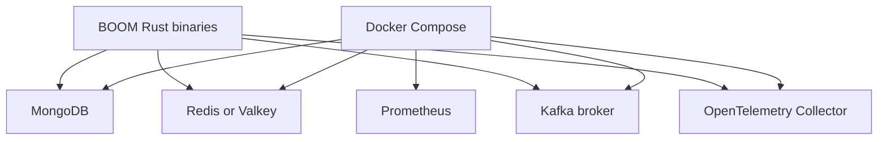

# Docker WSL and Local Setup

This note explains how BOOM runs as a local system and what you should take away from Docker and WSL beyond this specific project.

Related notes:

- [[Testing Debugging and Deployment]]
- [[Kafka Redis and Workers]]
- [[API and Backend]]
- [[Systems Lessons for AI ML]]

## Why This Note Matters

This project forced you to work on the part many people avoid:

- Linux-based development environments
- service orchestration
- native dependencies
- containers
- system debugging

Those are not side skills. They are core skills for backend, platform, and ML systems engineering.

## WSL: What It Gives You

WSL2 is a Linux environment on top of Windows.

For BOOM, that matters because:

- Rust dependencies behave more like the deployment environment
- shell scripts work as expected
- Docker integrates better with Linux-oriented tooling
- Kafka, Redis, and MongoDB workflows are easier to reason about from Linux

### Practical rule

Treat WSL as the real development machine.

That means:

- install system packages inside Ubuntu
- run `cargo`, `docker`, and helper commands there
- keep the BOOM repo in the Linux filesystem when possible

## Docker: Why BOOM Needs It

BOOM is not one binary. It depends on a set of supporting services:

- MongoDB
- Redis or Valkey
- Kafka
- OpenTelemetry Collector
- Prometheus

Docker Compose gives you:

- repeatable local infrastructure
- named services on a shared network
- quicker onboarding
- fewer host-machine dependency surprises

## Docker Concepts To Learn From BOOM

### Image

A packaged service runtime.

### Container

A running instance of an image.

### Compose

A declarative way to run multiple cooperating services.

### Volumes

Persistent storage across restarts.

### Networks

The internal connectivity model for containers.

### Profiles

A way to start only the services relevant to a certain workflow.

## BOOM's Local Infra Mental Model



## Local Setup Flow

### Step 1: install system packages in WSL

```bash
sudo apt update
sudo apt install build-essential pkg-config libssl-dev libsasl2-dev -y
```

Why they matter:

- `build-essential` gives you compiler and linker tooling
- `pkg-config` helps Rust crates find system libraries
- `libssl-dev` supports OpenSSL-related dependencies
- `libsasl2-dev` supports Kafka or SASL-related dependencies

### Step 2: copy environment variables

```bash
cp .env.example .env
```

Why it matters:

- BOOM uses environment-driven configuration for connection strings and secrets

### Step 3: start the infrastructure

```bash
docker compose --profile api up -d
```

What this does:

- starts the core backing services needed by the local stack

In practice that local stack usually includes:

- MongoDB
- Redis or Valkey
- Kafka
- OpenTelemetry collector
- Prometheus

### Step 4: build the Rust code

```bash
cargo build --release
```

## How To Reason About Docker In BOOM

Think in layers:

1. host machine
2. WSL Linux environment
3. Docker daemon and containers
4. BOOM Rust binaries talking to those services

This layered model helps you debug the right place instead of guessing.

A good operational question order is:

1. is WSL healthy?
2. is Docker healthy?
3. are the containers up?
4. is BOOM pointed at the right hosts and ports?
5. is the Rust binary itself failing?

## Common Failure Modes

### Compiler or linker missing

Likely cause:

- missing `build-essential`

### `openssl-sys` build failure

Likely cause:

- missing OpenSSL headers or `pkg-config`

### SASL library problem

Likely cause:

- missing `libsasl2-dev`

### Container is up but app still fails

Likely causes:

- wrong environment variables
- wrong hostnames or ports
- service not actually ready yet

### Kafka or topic issues

Likely causes:

- broker not healthy
- topic not created
- wrong survey or topic parameters

### Telemetry confusion

Likely causes:

- collector not running
- wrong OTLP endpoint
- Prometheus or collector pipeline misconfigured

## Deployment Lessons Hidden In Local Setup

`docs/deployment.md` matters even for local learning because it shows the production shape BOOM expects:

- Docker Engine
- Traefik reverse proxy
- GitHub self-hosted runner
- service networking
- secrets and domain config

## Command Recipes

### Check that Docker is healthy

```bash
docker ps
docker compose ps
```

### View logs for a specific service

```bash
docker compose logs broker
docker compose logs mongo
docker compose logs otel-collector
```

### Stop the local stack

```bash
docker compose down
```

### Rebuild after dependency changes

```bash
cargo clean
cargo build --release
```

### Sanity-check WSL environment

```bash
uname -a
which cargo
which docker
rustc --version
```

## Screenshot Placeholders

- [ ] WSL shell in the BOOM repo
- [ ] `docker compose ps` output
- [ ] `docker compose logs broker`
- [ ] successful `cargo build --release`
- [ ] one diagram showing services BOOM depends on

## Engineering Takeaways

- Docker is local engineering infrastructure, not only deployment tooling.
- WSL is valuable because it reduces environment drift.
- Most infrastructure bugs become manageable once you think in layers and verify each layer explicitly.
- This is directly useful in ML platform work where models also depend on storage, queues, containers, and services.

## Data view
### UROP notes that reference this concept
```dataview
TABLE type, status, file.folder
FROM "20_Progress/UROP"
WHERE file.path != this.file.path
AND contains(file.outlinks, this.file.link)
SORT file.folder ASC, file.name ASC
```
