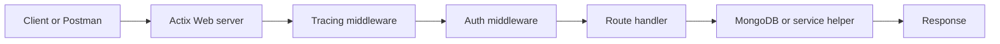

# API and Backend

This note explains BOOM's API as a backend system rather than just a list of endpoints.

Related notes:

- [[BOOM]]
- [[Postman]]
- [[Learning/MongoDB Data Model and Filters]]
- [[Learning/Observability and Tracing]]
- [[API Work]]

## Why This Note Matters

Even if you later focus on AI or ML, you still need backend instincts:

- services need APIs
- users need authenticated access
- model outputs need queryable systems
- observability matters more, not less, once models are in the loop

BOOM is a strong backend case study because it combines:

- an HTTP API
- JWT auth
- MongoDB access
- documentation generation
- tracing middleware

## Core Backend Files

- `src/bin/api.rs`
- `src/api/auth.rs`
- `src/api/db.rs`
- `src/api/docs.rs`
- `src/api/routes/*`

## Backend Request Path



## What `src/bin/api.rs` Teaches

The API entrypoint shows a pattern you will see in many services:

1. load environment and config
2. initialize tracing
3. build shared state
4. register middleware
5. register routes and docs
6. start the server

This is worth studying because it is a real service boot sequence, not toy code.

The actual `src/bin/api.rs` file adds a few details worth keeping in mind:

- `.env` is loaded before anything else
- tracing is initialized before config or DB setup
- DB and auth state are constructed before the server starts serving requests
- docs are built once at startup with `utoipa`
- shared state is injected with `web::Data`

## Middleware

Middleware wraps requests before they reach handlers.

In BOOM, middleware is used for:

- request tracing
- authentication

This is important because cross-cutting concerns should not be duplicated in every route.

In the actual server setup:

- `TracingLogger::default()` wraps the request lifecycle
- `auth_middleware` protects the `/api` scope
- Babamul uses a separate scope and middleware path

## Route Design

The API is split into domain groups:

- auth
- catalogs
- filters
- info
- Kafka-related endpoints
- users
- queries

That separation matters because backend code becomes hard to maintain when everything lives in one file.

It also shows what BOOM is becoming as an application:

- auth routes
- user-management routes
- filter creation and versioning routes
- catalog routes
- Kafka helper routes
- query routes

## Shared State With `web::Data`

Actix uses `web::Data` to inject application state into handlers.

Typical BOOM examples:

- config
- database
- auth provider
- email or notification helpers

This is one of the most practical patterns to carry into future backend work.

The shared state in BOOM includes:

- config
- MongoDB database handle
- auth provider
- email service

## Authentication

The auth flow centers on JWT tokens.

Important responsibilities:

- create token
- decode token
- validate token
- look up user state
- gate protected routes

This is exactly where tracing becomes valuable, because auth failures are often ambiguous without context.

The auth source code also shows a few concrete ideas worth learning:

- JWTs are created with typed claims containing `sub`, `iat`, and `exp`
- validation behavior depends on configuration
- the auth provider owns both encoding and decoding keys
- the user store is a MongoDB collection

## Database Responsibility In The API

The API is not just a thin database proxy. It also:

- initializes DB state
- ensures indexes
- supports user bootstrap flows
- shapes the data returned to clients
- enforces auth and permissions

## API Docs

BOOM uses `utoipa` and related tooling to derive docs from Rust code.

Why this matters:

- less drift between implementation and docs
- easier testing and onboarding
- better professional backend hygiene

## Request Lifecycle In Practice

The website's request-tree demos are useful because they are exactly how the backend should be reasoned about:

```text
HTTP request
  auth::middleware
    auth::authenticate_user
      auth::validate_token
        auth::decode_token
  route_handler
```

This tree tells you where the request died:

- no handler span means failure happened before the route ran
- handler span plus DB error means auth already succeeded
- decode failure means JWT formatting or token contents are likely wrong

## Command Recipes

### Run the API

```bash
cd ~/projects/boom
RUST_LOG=info,boom=debug OTEL_EXPORTER_OTLP_ENDPOINT=http://localhost:4317 cargo run --bin api
```

### Search route handlers

```bash
rg -n "#\\[.*(get|post|patch|delete)" src/api/routes
```

### Open the core backend files

```bash
sed -n '1,240p' src/bin/api.rs
sed -n '1,260p' src/api/auth.rs
sed -n '1,260p' src/api/db.rs
```

### Search shared-state injection

```bash
rg -n "web::Data|App::new|wrap\\(|service\\(" src/bin/api.rs src/api
```

## Screenshot Placeholders

- [ ] API startup terminal
- [ ] route docs or generated API docs page
- [ ] `/api/auth` request in Postman
- [ ] `/api/catalogs` trace tree
- [ ] one handler showing `#[instrument]`

## Engineering Takeaways

- Backend engineering includes startup, auth, docs, and observability, not just routes.
- Middleware is one of the highest-value abstractions in service code.
- Shared state injection is easier to reason about than hidden globals.
- API quality is strongly tied to how debuggable the request lifecycle is.

## Data view
### UROP notes that reference this concept
```dataview
TABLE type, status, file.folder
FROM "20_Progress/UROP"
WHERE file.path != this.file.path
AND contains(file.outlinks, this.file.link)
SORT file.folder ASC, file.name ASC
```
