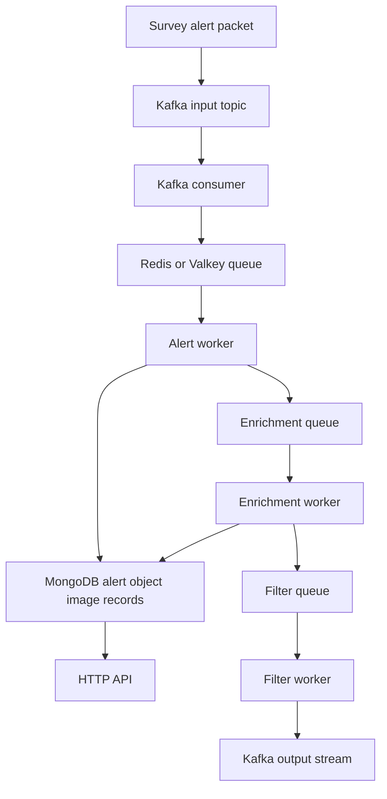

# Alerts and Data Flow

This note explains the core domain model of BOOM: what an alert is, what gets stored, and how data moves through the system.

Related notes:

- [[BOOM]]
- [[Learning/Kafka Redis and Workers]]
- [[Learning/MongoDB Data Model and Filters]]
- [[Mocks/Mock Alert Lifecycle]]

## Why This Note Matters

If you misunderstand what an alert is, the entire codebase feels abstract. This note exists to make the domain concrete.

## Core Vocabulary

### Survey

A survey repeatedly scans the sky and emits machine-readable alert packets when something changes.

Examples used by BOOM:

- ZTF
- LSST
- DECam

### Object

An object is the astrophysical source or candidate source being tracked across time.

Important distinction:

- object = the thing in the sky
- alert = one event or update about that object

### Alert

An alert is a machine-generated record saying:

- something at this position changed enough to be worth attention

Typical fields include:

- object ID
- candidate ID
- coordinates
- brightness information
- quality flags
- image cutouts
- survey-specific metadata

### Candidate

In practice, BOOM often uses candidate language for the individual alert instance being processed.

### Filter

A filter is user-defined logic that decides whether an enriched alert is worth forwarding or surfacing.

## What BOOM Is Actually Alerting On

BOOM is not alerting on a confirmed astrophysical result. It is handling candidate events detected by surveys.

That means a raw alert may correspond to:

- a real transient
- a variable source
- a moving object
- a noisy detection
- a false positive

The job of BOOM is to turn raw candidates into enriched, queryable, filterable records.

## Why There Are Multiple Stages

Raw survey packets are not useful enough by themselves. BOOM adds value by:

1. ingesting the raw stream
2. normalizing the data
3. storing internal records
4. enriching alerts with more context
5. evaluating filters
6. exposing useful results

## End-to-End Flow



## What Happens At Each Stage

### Kafka input

- survey packets arrive as a stream
- BOOM subscribes to the relevant topic

### Kafka consumer

- reads raw stream messages
- converts them into BOOM's internal pipeline handoff

### Redis or Valkey queue

- decouples streaming ingest from worker processing
- acts as BOOM's internal queue layer

### Alert worker

- parses and normalizes alert packets
- writes alert, object, and cutout data
- queues downstream enrichment work

### Enrichment worker

- adds context such as cross-matches or model outputs
- updates stored records
- prepares alerts for filtering

### Filter worker

- evaluates user-defined logic
- publishes passing results downstream

### API

- exposes stored and processed results to users and systems

## What Gets Stored

BOOM stores more than a raw pass-through copy. Depending on the path, it records:

- alerts
- objects
- cutouts or image data
- enrichment fields
- classifications
- filter definitions
- filter results

## Why This Matters For Engineering

The useful lesson is not just astronomy. It is:

- input data is rarely ready for direct consumption
- staged pipelines exist because different concerns belong at different boundaries
- storage design and message boundaries shape the whole system

## Command Recipes

### Open the main docs and module map

```bash
cd ~/projects/boom
sed -n '1,200p' README.md
sed -n '1,220p' src/lib.rs
```

### Search for survey and alert-related types

```bash
rg -n "struct .*Alert|enum .*Survey|candidate|object_id|candid" src
```

### Open core pipeline code

```bash
sed -n '1,220p' src/bin/kafka_consumer.rs
sed -n '1,260p' src/enrichment/base.rs
sed -n '1,260p' src/filter/base.rs
```

## Screenshot Placeholders

- [ ] one BOOM architecture diagram
- [ ] one survey alert payload example
- [ ] one terminal run of Kafka consumer or scheduler
- [ ] one collection or record view showing alert versus object data

## Engineering Takeaways

- A survey alert means "something changed," not "we already know what it is."
- A broker becomes useful when it adds storage, context, and filtering.
- Pipeline thinking is a transferable skill for data systems and ML systems work.

## Data view
### UROP notes that reference this concept
```dataview
TABLE type, status, file.folder
FROM "20_Progress/UROP"
WHERE file.path != this.file.path
AND contains(file.outlinks, this.file.link)
SORT file.folder ASC, file.name ASC
```
