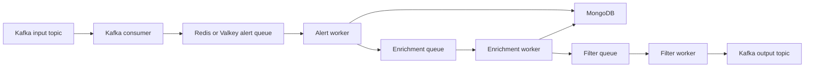

# Kafka Redis and Workers

This note explains BOOM as a staged processing system built around streams, internal queues, and worker pools.

Related notes:

- [[Learning/Alerts and Data Flow]]
- [[Learning/Observability and Tracing]]
- [[Learning/Docker WSL and Local Setup]]
- [[Mocks/Mock Alert Lifecycle]]

## Why This Note Matters

This is the note to study if you want to understand:

- event-driven architecture
- queue boundaries
- background processing
- worker orchestration
- the kind of systems that often sit underneath ML pipelines

## The Two Messaging Layers

The most important architectural distinction is:

- Kafka = ingress and egress stream layer
- Redis or Valkey = internal task queue layer

That is not redundancy. It is separation of responsibilities.

## Architecture Summary



## Kafka's Role

Kafka is a good fit for survey alert streams because:

- survey alerts are naturally streaming data
- Kafka handles high-throughput ordered message streams well
- downstream systems can also consume Kafka topics

Important concepts to understand:

- topic
- partition
- consumer group
- offsets
- producer vs consumer

Key BOOM files:

- `src/bin/kafka_consumer.rs`
- `src/bin/kafka_producer.rs`
- `src/kafka/base.rs`
- survey-specific files under `src/kafka/*`

The README makes the producer and consumer especially useful for learning:

- `kafka_producer` can replay archived public alerts into a topic
- `kafka_consumer` can drain that topic into BOOM's internal queues

That lets you exercise the pipeline on realistic data without waiting for a live survey stream.

## Redis Or Valkey's Role

Redis or Valkey is BOOM's internal handoff and queue layer.

Why use it:

- simple internal task passing
- decoupling between stages
- flexible scheduling for downstream workers

Why this is useful conceptually:

- not every queue in a system has the same job
- external stream layers and internal task queues often serve different needs

The architecture docs are explicit that Redis or Valkey was chosen because it is simple, fast, and practical as an internal queue primitive. That is a good design lesson by itself.

## Worker Types

### Alert worker

Responsibilities:

- parse and normalize incoming packets
- write alert, object, and image records
- queue enrichment work

The README describes alert workers as responsible for formatting alert packets to BSON and adding cross-match information before persistence. So alert ingestion is already a meaningful transformation stage.

### Enrichment worker

Responsibilities:

- load stored records
- run cross-matches and model-based logic
- write derived fields
- queue filter work

The real `src/enrichment/base.rs` code shows the concrete shape of a queue-driven worker:

- read a batch of alert IDs from Redis
- fetch corresponding alert documents from MongoDB
- optionally fetch cutouts
- run a trait-based enrichment implementation
- emit structured errors and metrics by worker and outcome

### Filter worker

Responsibilities:

- evaluate user-defined logic
- emit passing alerts downstream

The data-model docs explain why this happens after enrichment:

- filters become more powerful when they can use cross-match information, derived quantities, and model outputs

## Scheduler

The scheduler is the control layer for the worker system.

It:

- loads config
- starts worker pools
- coordinates queue processing
- emits lifecycle information
- handles shutdown

Key files:

- `src/bin/scheduler.rs`
- `src/scheduler/base.rs`

From the actual scheduler code, some details worth remembering are:

- it uses `clap` for typed CLI args
- it records `survey` and `deployment_env` in tracing fields
- it initializes indexes before workers start
- it logs worker counts on a 60-second heartbeat
- it shuts down through a signal task and channel

## Why This Architecture Is Worth Studying

It teaches several real systems ideas:

- external data streams and internal task queues are different concepts
- workers need lifecycle management, not just business logic
- queue boundaries are often where observability matters most
- throughput problems are usually architecture problems, not just code problems

## Website Connection

The pipeline section of the presentation site is a compressed version of this whole note:

- surveys publish to Kafka
- consumers push to Redis
- workers process and enrich
- MongoDB stores the result
- the API serves it back out

## Command Recipes

### Run the producer

```bash
cd ~/projects/boom
cargo run --release --bin kafka_producer ztf 20240617 public
```

### Run the consumer

```bash
cargo run --release --bin kafka_consumer ztf 20240617 public
```

### Run the scheduler

```bash
cargo run --release --bin scheduler ztf
```

### Search worker and queue-related code

```bash
rg -n "queue|worker|thread::spawn|consume|produce|redis|valkey|kafka" src
```

### Open the core orchestration files

```bash
sed -n '1,260p' src/bin/scheduler.rs
sed -n '1,260p' src/scheduler/base.rs
sed -n '1,260p' src/kafka/base.rs
```

## Screenshot Placeholders

- [ ] Kafka producer terminal
- [ ] Kafka consumer terminal
- [ ] scheduler startup and heartbeat logs
- [ ] diagram showing Kafka versus Redis responsibilities
- [ ] trace showing alert worker to enrichment worker flow

## Engineering Takeaways

- Many systems use multiple messaging layers with different jobs.
- Queue boundaries are the first place to add structured observability.
- Worker orchestration is a core backend skill with strong transfer value to data and ML platforms.

## Data view
### UROP notes that reference this concept
```dataview
TABLE type, status, file.folder
FROM "20_Progress/UROP"
WHERE file.path != this.file.path
AND contains(file.outlinks, this.file.link)
SORT file.folder ASC, file.name ASC
```
